<div align="center">

# Architect

**Design Minecraft buildings with Claude, review them as a ghost in your own world, and place them where they fit.**

*Powered by Claude*

[](https://www.minecraft.net)
[](https://fabricmc.net)
[](https://code.claude.com/docs/en/agent-sdk/overview)
[](LICENSE)

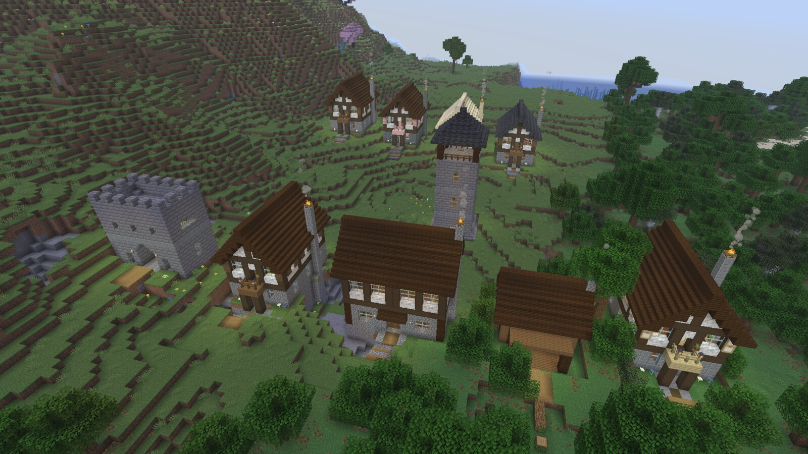

<sub>A village in a dev world at sunset: the Claude-designed Town House (rustic and birch) with the bundled tavern, watchtower and gatehouse.</sub>

</div>

<br>

Describe a building, or mark a plot on the ground. Claude designs it as **parametric code**, checks it against
the rules for its building type and renders previews. You review it as a translucent ghost on the real terrain,
place it, and keep it in a library where new variants cost nothing. **Remove** puts the land back exactly as it was.

Architect is a Fabric mod for singleplayer. It starts its own small helper in the background (a local Node process
that runs the Claude design agent), so there is no terminal and no server to set up.

<br>

## What it does

| | |
|---|---|
| **Describe it or mark a plot** | Pick a building type and a style, list materials and features, choose a size or mark two corners on the ground. The design is made to fit. |
| **Designs as code** | Claude writes each design as a small JavaScript program with 2 to 4 parameters of its own (width, floors, a porch...) and every material read from a palette. The source is kept next to the structure file. |
| **Checked before you see it** | A checker per building type: vanilla blocks only, a front door you can reach, a lit interior, floors reachable by stairs, a closed roof, nothing floating. A design that fails goes back to Claude, up to 4 rounds. |
| **Review as a ghost** | The building follows your view as a ghost. The HUD says what it would replace, how much foundation it adds and why it would refuse. Rotate, nudge, raise, lock, then place. |
| **Fits the land** | Terrain under and around the building is cleared, a foundation fills any gap under the floor on a slope, and an entrance path runs from the door to the ground. |
| **Exact Remove** | Everything the building covers is saved before it is placed. Remove restores it block for block, trees at the edge included. |
| **A library** | Every design you make, with previews, tags, favourites, rename, search and sort, plus Place, Remix and Export. |
| **Variants without Claude** | 10 palettes and each design's own parameters. A variant re-runs the design's code: no Claude call, under a second. |
| **Import and export** | Export writes a vanilla `.nbt` that a structure block or `/place template` can load. Import turns `.nbt` files and structure-block saves into library entries. |
| **No cheats needed** | Everything is in one screen (<kbd>B</kbd>). Placement runs on the game's own integrated server without op commands, so a Hardcore world works the same way. |

**Building types:** cabin, house, cottage, tower, shop, tavern, barn, smithy, chapel, gatehouse and custom. Each has
a style line in Claude's brief and a checker profile: a tower must be at least twice as tall as it is wide with three
reachable floors, a barn needs a wide entrance, a gatehouse a passage through it, and so on.

<br>

## How a design plays out

<table>
<tr>
<td width="50%" valign="top">

**1. Describe it.** Press <kbd>B</kbd>. Pick the type, a style chip or your own words, materials, up to six
features and a size, then add a name and notes. **Design it** sends it to Claude.

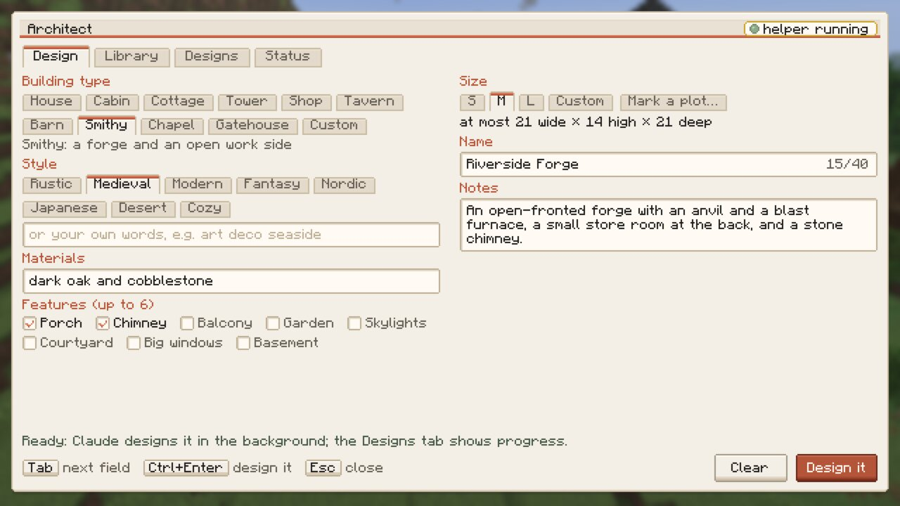

</td>
<td width="50%" valign="top">

**2. Or mark a plot.** **Mark a plot…** closes the screen: look at a corner and press <kbd>Enter</kbd>, then the
opposite one, with <kbd>PgUp</kbd>/<kbd>PgDn</kbd> for the height. The design is limited to that space.

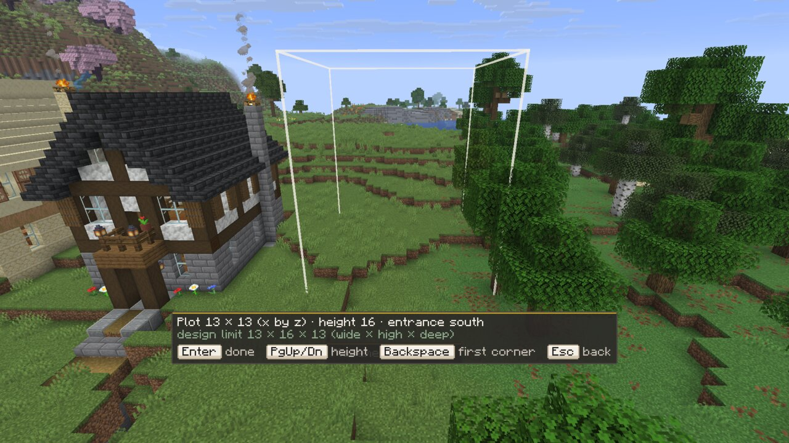

</td>
</tr>
<tr>
<td width="50%" valign="top">

**3. Claude designs it.** The job runs in the background while you play. The **Designs** tab shows each job's
progress and lets you cancel it. A real design takes about 4 to 6 minutes.

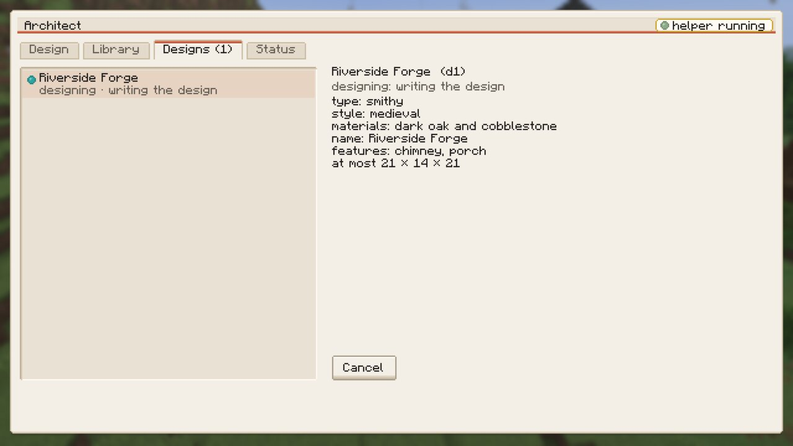

</td>
<td width="50%" valign="top">

**4. Review the ghost.** **Place** it from the Library; a design made for a plot opens locked on that plot.
Orange cells will be replaced, grey is foundation, tan is the entrance path, and the HUD says why it would refuse.

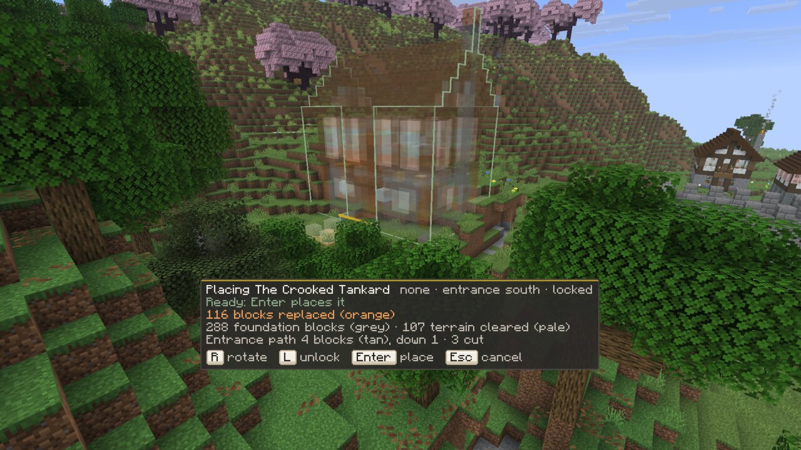

</td>
</tr>
<tr>
<td width="50%" valign="top">

**5. Place it.** <kbd>Enter</kbd> builds it at once, cutting into the slope and filling a foundation under the
low side.

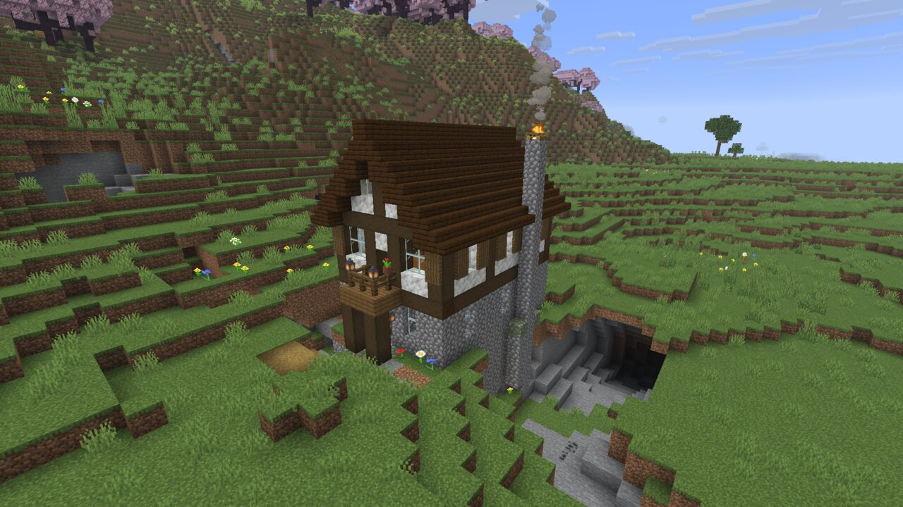

</td>
<td width="50%" valign="top">

**6. Step inside.** Every standable cell inside is lit by vanilla light sources, which the checker enforces.

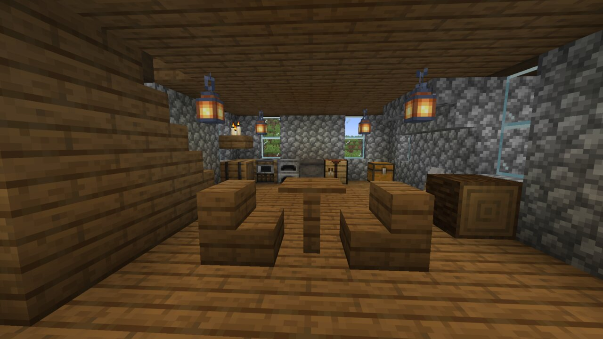

</td>
</tr>
</table>

<br>

## The library

<table>
<tr>
<td width="50%">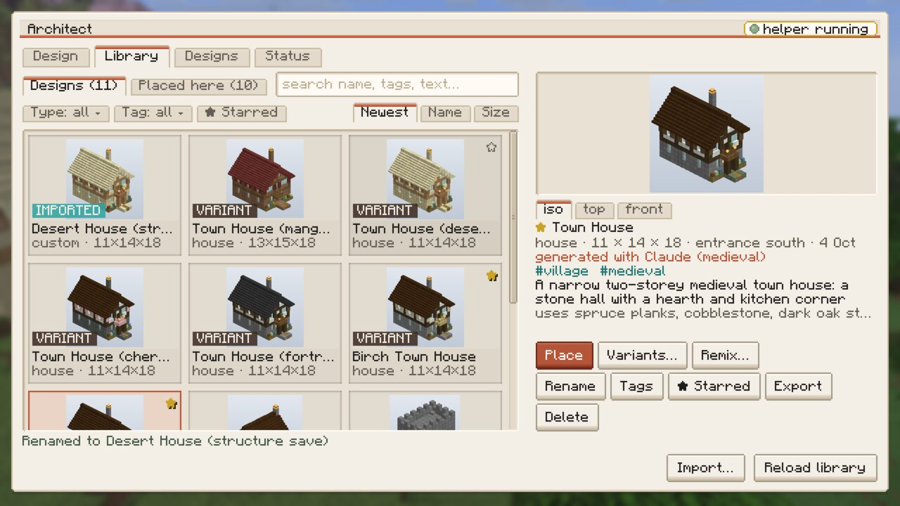</td>
<td width="50%">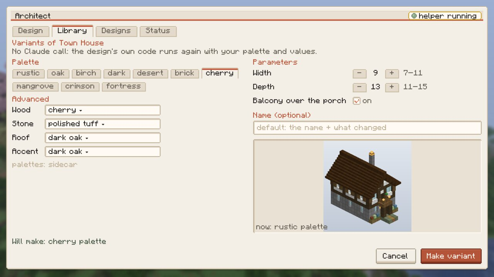</td>
</tr>
<tr>
<td><b>Library.</b> Previews (iso, top, front), badges for variants and imports, filters by type and tag, starred designs, search, and where each design came from. Place, Variants…, Remix…, Rename, Tags, Export, Delete.</td>
<td><b>Variants….</b> A palette preset or your own wood, stone, roof and accent, plus the parameters the design declared. The design's code runs again: no Claude call.</td>
</tr>
</table>

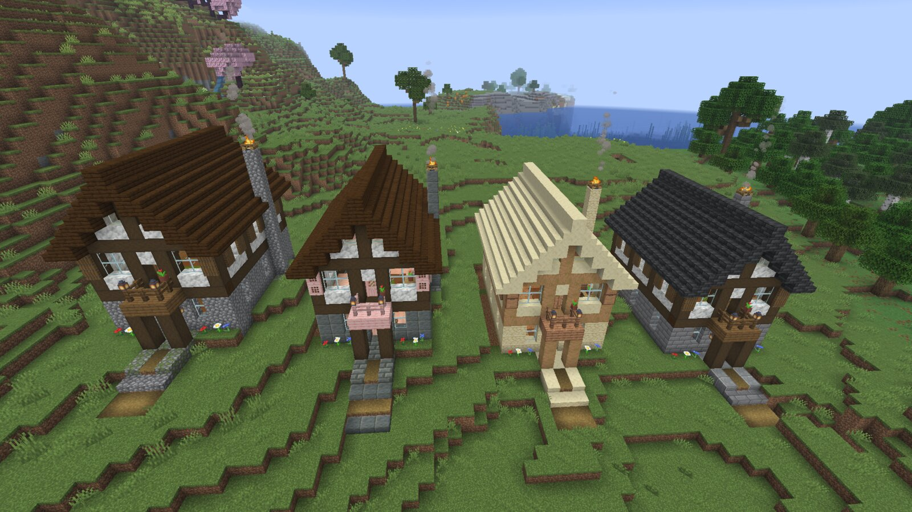

<sub>One Claude design in four palettes, placed in a row: rustic (the original), cherry, desert and fortress. Each variant took under a second.</sub>

- **Palettes:** rustic, oak, birch, dark, desert, brick, cherry, mangrove, crimson and fortress, or any mix of
  wood, stone, roof and accent.
- **Parameters:** each design declares its own. Claude is asked to make every combination build and pass the
  checker, and a variant that doesn't pass fails with the checker's reasons instead of landing in the library.
- **Remix…** reopens the Design tab with the original request and an empty "what to change" note. That one uses
  Claude.
- **Export** writes `<id>.nbt` and its metadata to `architect/exports/<id>/`, and copies the `.nbt` into the
  current world as `architect_mc:<id>`, so a vanilla structure block can load it.
- **Import…** lists `.nbt` files in `architect/imports/`, `architect/exports/` and this world's structure-block
  saves. An import is checked and gets previews. It has no source code, so it has no variants.

<br>

## Placement

<table>
<tr>
<td width="50%">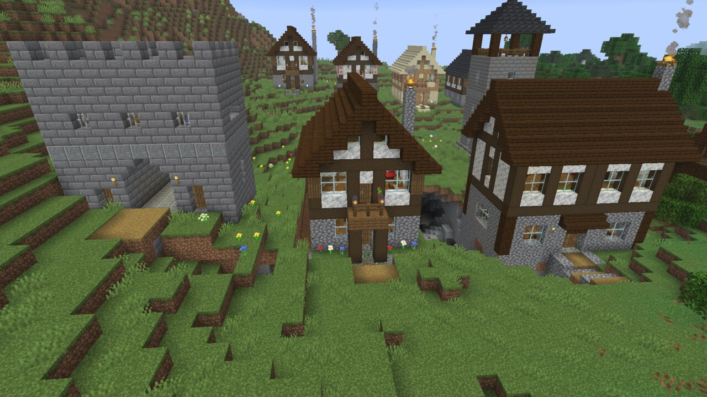</td>
<td width="50%">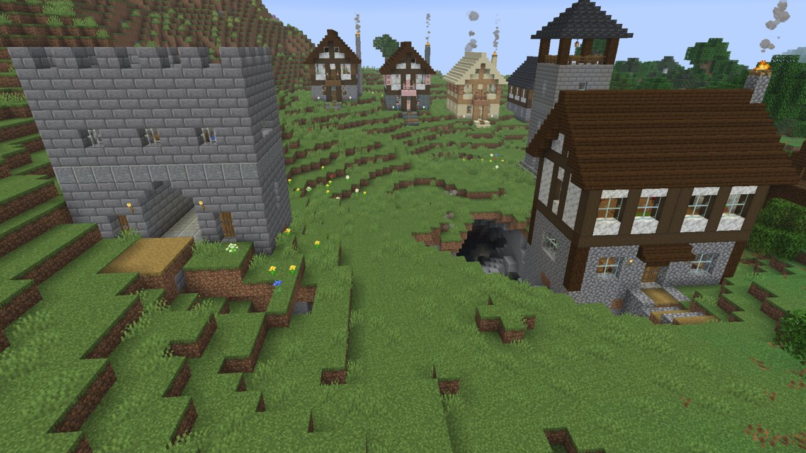</td>
</tr>
<tr>
<td><b>Placed.</b> The Town House on a slope, with 157 foundation blocks and 100 terrain blocks cleared.</td>
<td><b>Removed.</b> The ground is back block for block. The hash of the area after Remove matched the hash before placing.</td>
</tr>
</table>

- **Terrain fit.** The ghost sits on the median ground height of its footprint. Terrain inside the box is cleared,
  and a foundation in the design's own block fills any gap under the floor.
- **Entrance approach.** A path runs from the door to the ground in front, with steps where the ground falls away.
  The HUD flags drops, gullies and caves under the path.
- **Refusals.** It won't place into lava, over chests and other block entities (unless you confirm with
  <kbd>Shift</kbd>+<kbd>Enter</kbd>; they come back on Remove), with you, a pet, a villager or another animal in
  the box, or over items you dropped. Water is a warning. Hostile mobs that would despawn anyway are removed, and
  sticks, saplings and leaf litter from decay are cleared with a note.
- **Leaf guard.** While a building stands, leaves near its box that hang on logs it replaced are kept from
  decaying, and they get their state back on Remove.
- **Bed safety.** In the Nether and the End, where beds explode, the design's beds are left out.
- **Remove** restores the snapshot. It stops first if your own things are in the box, until you take them out or
  press **Remove anyway**. **Move…** places it again elsewhere, with **Undo move**. Both are in the Library's
  **Placed here** list.

<br>

## Coming next: survival

> **Not in this build yet.** Phase 3 is in development; see [docs/PLAN.md](docs/PLAN.md) and the phase 3 section
> of [docs/CONTRACT.md](docs/CONTRACT.md).

In a survival or Hardcore world, Place will put down a **construction site**: a ghost of what's left to build and a
crate at the entrance. You feed the crate by hand or from a hopper chain, and the site builds itself bottom-up as
the materials arrive. A bill of materials shows what it needs, and logs count as planks. Deconstruct refunds what
the site placed, then restores the terrain exactly. Creative worlds keep instant placement, and survival is a
per-world toggle.

<br>

## Quick start

**You need:**

- Minecraft: Java Edition 26.3 with Fabric Loader 0.19.5 or newer and Fabric API.
- Java 25.
- Node.js 22 or newer.
- An Anthropic API key (see [Auth](#auth)).

There is no release download yet; build the mod from source:

```sh
git clone https://github.com/larattalabs/architect-mc
cd architect-mc
(cd sidecar && npm ci && npm run build)   # the helper, bundled into the jar
(cd mod && ./gradlew build)               # mod/build/libs/architect_mc-0.1.0.jar
```

Put the jar and Fabric API in your Fabric 26.3 instance's `mods/` folder and start the game.

- **The mod starts the helper itself.** It finds Node (set `nodePath` in `config/architect_mc.json` if it can't),
  unpacks the helper into `<game dir>/architect/sidecar/`, and reuses a helper that is already running. When the
  game exits, it stops the helper it started.
- **On first run** it installs the Claude Agent SDK, about 200 MB including a native binary, with the progress
  shown in game.
- **Then:** press <kbd>B</kbd>, open **Status**, paste your API key, and design something.

The bundled cabin, tower, tavern and gatehouse examples are in the Library from the start, so you can place them
and make variants before you add a key.

<br>

## Controls

| Key | What it does |
|---|---|
| <kbd>B</kbd> | Open Architect (rebindable in Options, Controls) |
| <kbd>1</kbd>–<kbd>4</kbd> | Design, Library, Designs, Status tabs |
| <kbd>Tab</kbd> / <kbd>Ctrl</kbd>+<kbd>Enter</kbd> | Next field / Design it (Design tab) |

**While placing a ghost:**

| Key | What it does |
|---|---|
| <kbd>R</kbd> / <kbd>Shift</kbd>+<kbd>R</kbd> | Rotate a quarter turn / back |
| Arrow keys | Nudge forward, back, left and right |
| <kbd>PgUp</kbd> / <kbd>PgDn</kbd> | Raise / lower |
| <kbd>L</kbd> | Lock it in place (walk around it) or follow your view again |
| <kbd>Enter</kbd> | Place |
| <kbd>Shift</kbd>+<kbd>Enter</kbd> | Place anyway, after a warning about block entities in the box |
| <kbd>Esc</kbd> / <kbd>Backspace</kbd> | Cancel |

**While marking a plot:** <kbd>Enter</kbd> sets a corner, <kbd>PgUp</kbd>/<kbd>PgDn</kbd> change the height
(<kbd>Shift</kbd> for 4 at a time), <kbd>Backspace</kbd> goes back a corner, <kbd>Esc</kbd> cancels.

**Commands** (none need cheats): `/architect` opens the screen, `/architect place <id> [rotation]`,
`/architect remove <site>`, `/architect list`, `/architect reload`.

<br>

## Auth

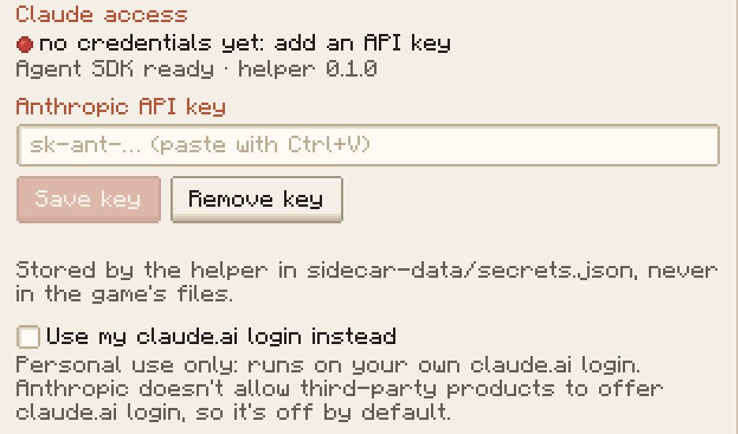

**An Anthropic API key is the supported setup.** Create one at
[console.anthropic.com](https://console.anthropic.com). The helper looks for credentials in this order:

1. `ANTHROPIC_API_KEY` in the environment;
2. the key pasted into the Status tab, which the helper stores in `architect/sidecar-data/secrets.json`
   (owner-only, never logged, never in the game's files);
3. a cloud provider supported by the Agent SDK: Amazon Bedrock, Google Vertex AI or Microsoft Foundry.

**Personal use only: your claude.ai login.** If you use the Claude Code CLI, the Status toggle **Use my claude.ai
login instead** (or `--use-claude-login` when running the helper by hand) runs the designer on your local
`claude` login. It is off by default and meant only for running Architect yourself. From the
[Agent SDK overview](https://code.claude.com/docs/en/agent-sdk/overview): *"Unless previously approved, Anthropic
does not allow third party developers to offer claude.ai login or rate limits for their products."*

<br clear="right">

<br>

## How it works

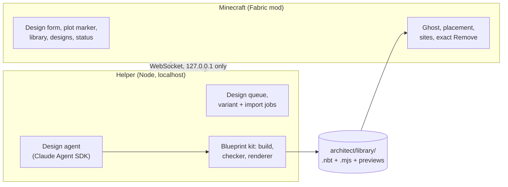

- **The mod** (`mod/`) is the screen, the ghost and the placement. It launches the helper and talks to it over a
  localhost WebSocket with a per-start token.
- **The helper** (`sidecar/`) runs one design job at a time in a scratch folder with a fresh copy of the kit. The
  agent may only edit its own design file. It has no network access, subagents or git, and anything that would need
  a permission prompt is refused. The finished design is checked again with a pristine copy of the kit before it is
  installed into the library. Usage-limit holds and restarts resume the same session.
- **The kit** (`kit/`) is plain JavaScript with no dependencies: a building API (walls, roofs, stairs, windows,
  doors, lighting...), a generated table of every vanilla 26.3 block, the checker, and an offline renderer for the
  previews.
- **A library entry** is `<id>.nbt` (a vanilla structure template), `<id>.blueprint.json` (size, entrance, anchors,
  palette, parameters, the request), `<id>.mjs` (the source) and three preview PNGs, under `<game dir>/architect/library/`.

<br>

## Costs

A design bills per token to your Anthropic account, or to your plan with the personal-use login. With the default
settings (Opus 5.5 at effort high), a real design took about 4 to 6 minutes and cost $1.00 to $1.50 in the gate
runs. Model, effort, a turn limit and a per-design budget cap can be set in
`architect/sidecar-data/config.json`:

```json
{ "designModel": "claude-opus-5-5", "effort": "high", "maxTurns": 120, "maxBudgetUsd": 5 }
```

Variants, imports, exports and placement never call Claude and cost nothing. A variant takes under a second.

<br>

## Project layout

| Path | What lives there |
|---|---|
| [`mod/`](mod) | The Fabric mod: placement, ghost, plot marker, the Architect screen, the launcher, the DevBridge |
| [`sidecar/`](sidecar) | The helper: design queue, Claude design agent, variants and imports, auth ([README](sidecar/README.md)) |
| [`kit/`](kit) | The blueprint kit: design API, checker profiles, renderer, examples ([README](kit/README.md)) |
| [`tools/`](tools) | DevBridge CLI, the scene screenshot runner and the README screenshot tooling |
| [`docs/`](docs) | [PLAN.md](docs/PLAN.md) (phases, decisions, status) and [CONTRACT.md](docs/CONTRACT.md) (formats and protocol) |

<br>

## Development

```sh
cd sidecar && npm run check                  # typecheck + tests, including an end-to-end test of the bundle
node --test kit/test/*.test.mjs              # kit tests, including every parameter x palette combination
cd mod && ./gradlew test                     # mod unit tests (JAVA_HOME = a Java 25 JDK)
cd mod && ./gradlew runClient                # a dev client in its own dev world
```

`./gradlew runClient` creates a dev world, "Architect Dev" (creative, natural terrain, seed 2026), and opens it.
Point it at your checkout's helper with `ARCHITECT_SIDECAR_DIR=$PWD/../sidecar`. The **DevBridge** is a small
localhost API in dev runs (port 7891) that scripts use to drive the screen, the ghost and the camera and to take
screenshots: `node tools/devcli.mjs help`.

Every in-game image in this README was taken that way, in a dev world and without any Claude calls:
`tools/run-readme-client.sh`, `node tools/shoot.mjs tools/scenes/readme.json --port 7991`, then
`node tools/readme-images.mjs`. The Town House is a real Claude design from the phase 2 gate run. Its variants and
the import were made through the UI. The cabin, tower, tavern and gatehouse are the kit's hand-written examples.

<br>

## Status

Architect is early.

- **Phase 1** (design, ghost, place, exact Remove) and **phase 2** (library, variants, import/export) passed their
  gates in dev worlds, with real Claude designs, in October 2026. **Phase 3** (survival construction sites) has
  started.
- **Singleplayer only**, on **Minecraft 26.3**. Dedicated servers are out of scope: the design agent's code runs on
  your machine.
- **Run on macOS (Apple Silicon) so far.** The launcher knows the Windows paths, but Windows hasn't been tested.
- **Known issues:** in the Nether the ghost starts on the bedrock roof (give it a lower spot), exports carry no
  source, so an imported export has no variants, and a full no-cheats Hardcore playthrough is still to come. The
  list is in [docs/PLAN.md](docs/PLAN.md).

<br>

## License

[MIT](LICENSE). Minecraft is not included: Gradle downloads it from Mojang for development, and players need
their own copy of Minecraft: Java Edition. Architect is not affiliated with Mojang, Microsoft or Anthropic.

**Credits.** The placement code (terrain fit, entrance approach, ghost, snapshot and restore) and the blueprint kit
come from [AgentCraft](https://github.com/blendi-remade/agentcraft) by its contributors (MIT; the notice is in
[LICENSE](LICENSE)). Architect grew out of the building designer in the
[nlaratta/agentcraft](https://github.com/nlaratta/agentcraft) fork and is now a separate mod.

<div align="center">
<br>
<sub>Built with Claude.</sub>
</div>
