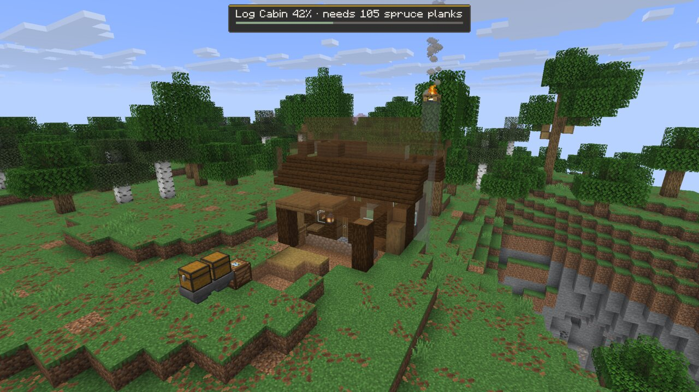
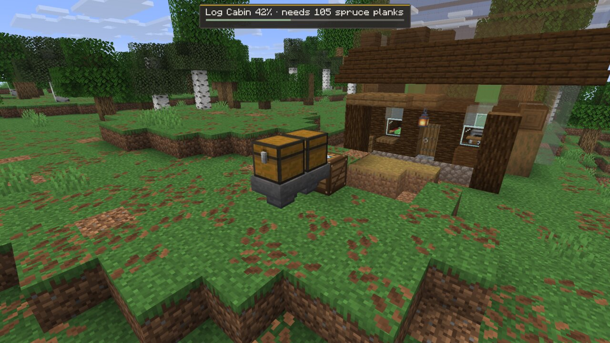
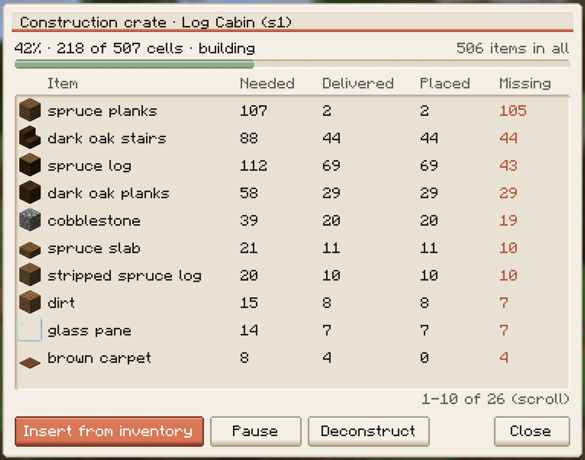
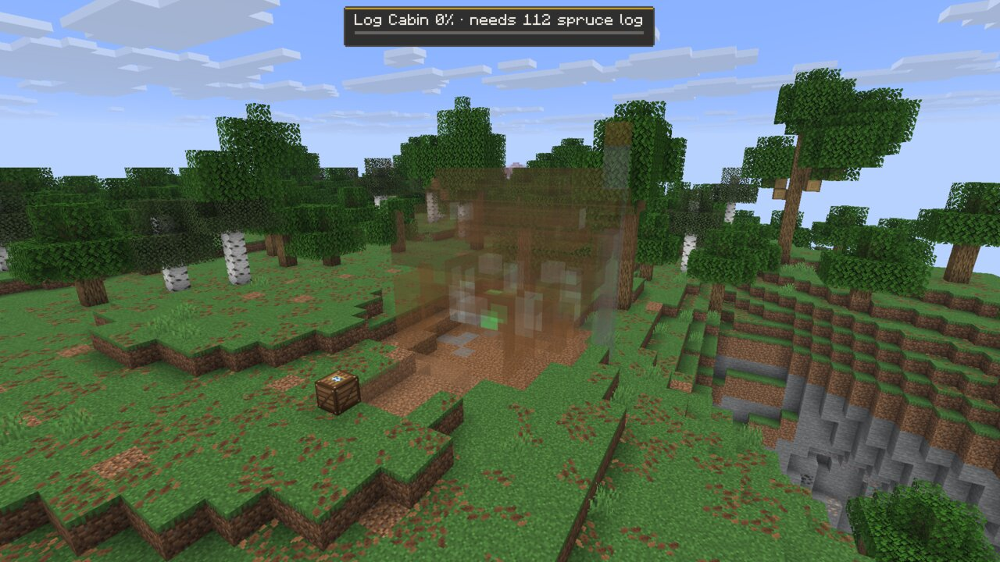
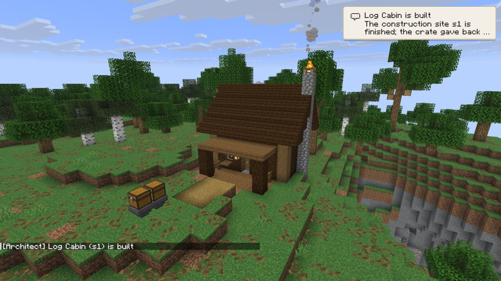
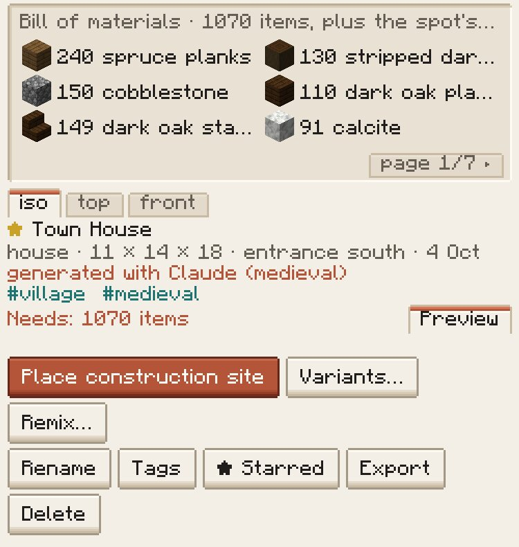
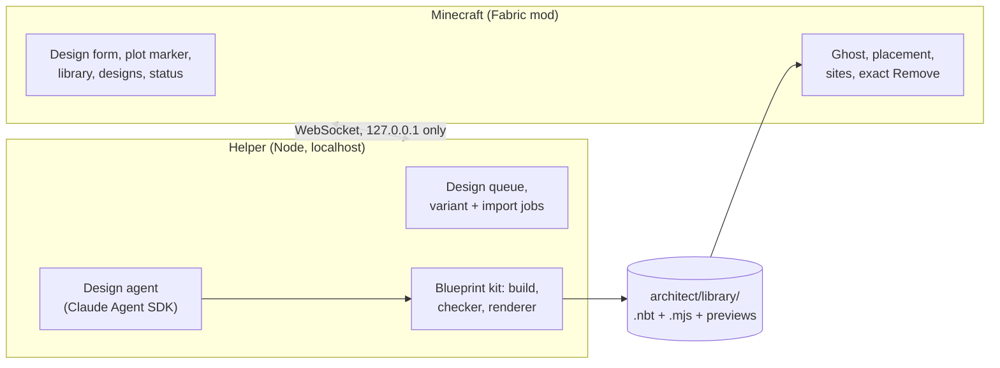

<div align="center">

# Architect

**Design Minecraft buildings with Claude, review them as a ghost in your own world, and place them where they fit.**

*Powered by Claude*

[](https://www.minecraft.net)
[](https://fabricmc.net)
[](https://code.claude.com/docs/en/agent-sdk/overview)
[](LICENSE)


<sub>A village in a dev world: the Claude-designed Town House (rustic and birch) with the bundled gatehouse, tavern, log cabin and watchtower, and the Town House in four palettes behind them.</sub>

</div>

<br>

Describe a building, or mark a plot on the ground. Claude designs it as **parametric code**, checks it against
the rules for its building type and renders previews. You review it as a translucent ghost on the real terrain,
place it, and keep it in a library where new variants cost nothing. **Remove** puts the land back exactly as it was.
In a survival world, Place puts down a **construction site** instead, and the building goes up as you feed it the
materials.

Architect is a Fabric mod for singleplayer. It starts its own small helper in the background (a local Node process
that runs the Claude design agent), so there is no terminal and no server to set up.

<br>

## What it does

| | |
|---|---|
| **Describe it or mark a plot** | Pick a building type and a style, list materials and features, choose a size or mark two corners on the ground. The design is made to fit. |
| **Designs as code** | Claude writes each design as a small JavaScript program with 2 to 4 parameters of its own (width, floors, a porch...) and every material read from a palette. The source is kept next to the structure file. |
| **Checked before you see it** | A checker per building type. Hard rules: vanilla blocks only, a working outside door, a lit interior. Warnings Claude is asked to fix: a front door you can walk to, floors reachable by stairs, a closed roof, nothing floating. A design that breaks a hard rule goes back to Claude, up to 4 rounds. |
| **Review as a ghost** | The building follows your view as a ghost. The HUD says what it would replace, how much foundation it adds and why it would refuse. Rotate, nudge, raise, lock, then place. |
| **Fits the land** | Terrain under and around the building is cleared, a foundation fills any gap under the floor on a slope, and an entrance path runs from the door to the ground. |
| **Exact Remove** | Everything the building covers is saved before it is placed. Remove restores it block for block, trees at the edge included. |
| **A library** | Every design you make, with previews, tags, favourites, rename, search and sort, plus Place, Remix and Export. |
| **Variants without Claude** | 10 palettes and each design's own parameters. A variant re-runs the design's code: no Claude call, under a second. |
| **Import and export** | Export writes a vanilla `.nbt` that a structure block or `/place template` can load. Import turns `.nbt` files and structure-block saves into library entries. |
| **Survival construction sites** | In survival and Hardcore, Place puts down a ghost and a crate. Feed the crate by hand or from hoppers; it takes only what the building still needs and builds a few blocks per tick. Deconstruct refunds what you paid for and puts the terrain back exactly. |
| **Built for no-cheat worlds** | Everything is in one screen (<kbd>B</kbd>), and placement, construction sites and Deconstruct need no op commands. Tested in a Hardcore world without cheats: a site places, builds from its crate and deconstructs, while the survival toggle and the free `site finish` stay locked. |

**Building types:** cabin, house, cottage, tower, shop, tavern, barn, smithy, chapel, gatehouse and custom. Each has
a style line in Claude's brief and a checker profile (warnings for now): a tower should be at least twice as tall as it
is wide with three reachable floors, a barn needs a wide entrance, a gatehouse a passage through it, and so on.

<br>

## How a design plays out

<table>
<tr>
<td width="50%" valign="top">

**1. Describe it.** Press <kbd>B</kbd>. Pick the type, a style chip or your own words, materials, up to six
features and a size, then add a name and notes. **Design it** sends it to Claude.


</td>
<td width="50%" valign="top">

**2. Or mark a plot.** **Mark a plot…** closes the screen: look at a corner and press <kbd>Enter</kbd>, then the
opposite one, with <kbd>PgUp</kbd>/<kbd>PgDn</kbd> for the height. The design is limited to that space.


</td>
</tr>
<tr>
<td width="50%" valign="top">

**3. Claude designs it.** The job runs in the background while you play. The **Designs** tab shows each job's
progress and lets you cancel it. A real design takes about 4 to 6 minutes.


</td>
<td width="50%" valign="top">

**4. Review the ghost.** **Place** it from the Library; a design made for a plot opens locked on that plot.
Orange cells will be replaced, grey is foundation, tan is the entrance path, and the HUD says why it would refuse.


</td>
</tr>
<tr>
<td width="50%" valign="top">

**5. Place it.** <kbd>Enter</kbd> builds it at once, cutting into the slope and filling a foundation under the
low side.


</td>
<td width="50%" valign="top">

**6. Step inside.** Every standable cell inside is lit by vanilla light sources, which the checker enforces.


</td>
</tr>
</table>

<br>

## Critique and revise (experimental)

> **Experimental.** In the 5a eval the loop did not measurably improve designs (blind judge 7 wins, 6 losses, 5 ties over 18
> briefs), so it stays off by default. The one-off **Critique** report is the useful part today.

Turn on **Critique and revise** in the Design tab or the set dialog, or by default in the Status tab, and a second, cheaper
Claude call reviews each design after it renders. It looks at fixed renders from five cameras, layered slices of the floors and a
summary of the blueprint, scores silhouette, legibility, craft, materials and the brief (plus the style bible and the set's
neighbours when there are any), and lists at most six issues, each tied to a named part. The designer then revises the same
design, up to two times, and the best version goes into the library. Its scores and open issues show in the Designs tab and
the Library, and **Critique** on a library entry runs a one-off report (about $0.05).

The loop at most about doubles a design's cost, and it is off by default. In the gate's full eval (18 Sonnet designs), it
added on average $1.06 and 3 minutes to a $2.02 design. A blind Opus judge preferred the revised version 7 times, the original
6 times, and called 5 even, so a clear improvement is **not shown** yet (details in [docs/PLAN.md](docs/PLAN.md)).

<br>

## The library

<table>
<tr>
<td width="50%"></td>
<td width="50%"></td>
</tr>
<tr>
<td><b>Library.</b> Previews (iso, top, front), badges for variants and imports, filters by type and tag, starred designs, search, and where each design came from. Place, Variants…, Remix…, Rename, Tags, Export, Delete.</td>
<td><b>Variants….</b> A palette preset or your own wood, stone, roof and accent, plus the parameters the design declared. The design's code runs again: no Claude call.</td>
</tr>
</table>


<sub>One Claude design in four palettes, placed in a row: rustic (the original), cherry, desert and fortress. Each variant took under a second.</sub>

- **Palettes:** rustic, oak, birch, dark, desert, brick, cherry, mangrove, crimson and fortress, or any mix of
  wood, stone, roof and accent.
- **Parameters:** each design declares its own. Claude is asked to make every combination build and pass the
  checker, and a variant that doesn't pass fails with the checker's reasons instead of landing in the library.
- **Remix…** reopens the Design tab with the original request and an empty "what to change" note. That one uses
  Claude.
- **Export** writes `<id>.nbt` and its metadata to `architect/exports/<id>/`, and copies the `.nbt` into the
  current world as `architect_mc:<id>`, so a vanilla structure block can load it.
- **Import…** lists `.nbt` files in `architect/imports/`, `architect/exports/` and this world's structure-block
  saves. An import is checked and gets previews. It has no source code, so it has no variants.

### Versions, updates and polish

- **Versions.** An entry keeps its versions (`versions/<n>/` inside it, the id stays the same). The Library's
  **Compare…** shows what changed per named part, and **Revert to v(n-1)** makes the old version the new head.
- **Update a placed building.** A site placed from an older version shows **Update…** in the Placed view, with a ghost
  of the change: green for added blocks, red frames for removed ones, amber for changed ones and a yellow frame for
  blocks you changed yourself, which the update keeps by default. Only the cells that differ are written, so chests,
  open doors and your own edits elsewhere stay as they are. **History** lists the versions; a creative revert is an exact
  undo, Remove still restores the terrain exactly, and in survival an update (or "Rebuild as v1") is a construction job
  fed from a new crate, with refunds for what it takes away.
- **Polish… (dev flag: start the game with `-Darchitect.dev.polish=true`).** A critic names one problem with one part, and the designer edits only that part, as a new
  version. In the 5b evaluation the critic did not accept the edits, so polish rarely produces a new version yet.

<br>

## Placement

<table>
<tr>
<td width="50%"></td>
<td width="50%"></td>
</tr>
<tr>
<td><b>Placed.</b> The Town House on a slope, with 157 foundation blocks and 100 terrain blocks cleared.</td>
<td><b>Removed.</b> The ground is back block for block. The hash of the area after Remove matched the hash before placing.</td>
</tr>
</table>

- **Terrain fit.** The ghost sits on the median ground height of its footprint. Terrain inside the box is cleared,
  and a foundation in the design's own block fills any gap under the floor.
- **Entrance approach.** A path runs from the door to the ground in front, with steps where the ground falls away.
  The HUD flags drops, gullies and caves under the path.
- **Refusals.** It won't place into lava, over chests and other block entities (unless you confirm with
  <kbd>Shift</kbd>+<kbd>Enter</kbd>; they come back on Remove), with you, a pet, a villager or another animal in
  the box, or over items you dropped. Water is a warning. Hostile mobs that would despawn anyway are removed, and
  sticks, saplings and leaf litter from decay are cleared with a note.
- **Leaf guard.** While a building stands, leaves near its box that hang on logs it replaced are kept from
  decaying, and they get their state back on Remove.
- **Bed safety.** In the Nether and the End, where beds explode, the design's beds are left out.
- **Remove** restores what was there. It stops first if your own things are in the box, until you take them out or
  press **Remove anyway**. **Move…** places it again elsewhere, with **Undo move**. Both are in the Library's
  **Placed here** list.
- **Layering (the world journal).** Every placement records the cells it changes, with what was there before, in a
  per-world journal (`<world>/architect-journal/`). Sites may overlap: when a placement would overlap another site, the
  ghost refuses once and a second <kbd>Enter</kbd> ("Place on top") puts it on top. Remove works in any order: a
  site under another one gives its covered cells to the site on top, which restores them when it goes. Removing a
  covered site asks once ("Remove both" also takes the sites on top down). A layered site can't be moved.
- **Roads.** `/architect road <x z> <x z> ... [width]` lays a road along waypoints: it follows the ground (at most
  one block up or down per step, cuts and fills up to 4), skips buildings and other roads, and runs over terrain
  pads. Too steep or deep water refuses. A building's entrance approach stops at a road. Removing a road restores its
  cells and hands the cells where it crosses another road over to that road.

<br>

## Survival



<sub>A Log Cabin site at 42%, fed from two chests through hoppers. The HUD names the next thing it is waiting for.</sub>

**A per-world toggle.** Survival construction sites are on by default in survival and Hardcore worlds and off in
creative ones. The Status tab and `/architect survival` show the setting. Changing it needs cheats (permission level 2):
`/architect survival on|off`. With it off, Place is instant, as in creative.

**A construction site.** With it on, Place runs the same checks as before, saves the terrain and clears the spot for
free. Then it puts down a **ghost** of the building and a **construction crate** next to the end of the entrance path.
The ghost stays across relogs and restarts, and the cells whose items are already in the crate are tinted green. While
you are within 64 blocks, a HUD line shows the progress and what the site needs next.

<table>
<tr>
<td width="50%"></td>
<td width="50%"></td>
</tr>
<tr>
<td><b>Feeding.</b> Hoppers and droppers feed the crate from any side, or you put items in by hand.</td>
<td><b>The crate.</b> The bill of materials with needed, delivered, placed and missing counts, plus Insert from inventory, Pause and Deconstruct.</td>
</tr>
</table>

- **The crate takes only what the site still needs**, so a hopper chain never jams on other items. **Insert from
  inventory** moves every needed item from your inventory. Players can't break the crate while the site is building,
  and explosions don't destroy it.
- **The bill of materials** counts every block the instant placement would write: the building, plus that spot's
  foundation and entrance approach. The Library shows the design's own count before you place it. A door, bed or tall
  plant costs one item, a double slab costs two slabs, and wall torches and wall signs cost the standing item. Path
  blocks, farmland and grass blocks cost **dirt**. A design that uses a block
  survival can't get (a spawner, bedrock, a command block...) is refused at placement. Waterlogged cells are built dry.
- **Raw materials count, one way, at vanilla yields.** One log is 4 planks of its wood, one plank is 2 slabs, and a
  stonecutter block counts as what it cuts into (stone to stone bricks, cobblestone to its slab, stairs or wall).
  Nothing converts back and nothing skips smelting. When a conversion yields more than the site needs, the rest stays
  in the crate as credit and comes back when the site is done.
- **It builds a few blocks per tick** (4 by default, up to 64, set in the world's `architect-world.json`), from the
  ground up, with whatever is in the crate. It only builds in loaded chunks. If something stands in a cell, the site
  skips it and tries again, and the crate screen reports the cell if it stays blocked.
- **The finished building is identical to an instant placement**, block entities included. In the phase 3 gate run, a
  cabin site of 507 cells with a 506-item bill of materials, fed by hoppers and partly with logs, finished with the same
  hash as an instant placement at the same spot.
- **When it's done**, the crate gives back any leftovers and credit and disappears, and its cell is restored.

<table>
<tr>
<td width="50%"></td>
<td width="50%"></td>
</tr>
<tr>
<td><b>Placed.</b> The spot is cleared and the whole cabin is a ghost. The HUD asks for 112 spruce logs.</td>
<td><b>Built.</b> 507 of 507 cells. The crate is gone, and a toast and a chat line say so.</td>
</tr>
</table>



**In the Library**, a survival world shows each design's bill of materials and "Needs: N items", and Place becomes
**Place construction site**.

**Deconstruct** (the crate screen's **Deconstruct**, **Remove** in the Library's **Placed here** list, or
`/architect remove <site>`):

- Blocks the site placed and you paid for, still in place, are **refunded** as items at the crate's spot.
- **Blocks you mined from the site aren't refunded**: you already have them. In the gate run, mining 3 logs and then
  deconstructing refunded exactly 506 − 3 = 503 items.
- Cells that `/architect site finish` placed for free refund nothing.
- **Your own blocks** in the box drop as items.
- Then the terrain comes back **exactly**, as with Remove in creative.
- A container you filled still stops it, as before. Move is refused in survival: deconstruct and place again.

**Clearing a site gives no terrain drops.** The trees and dirt a site clears vanish, and Deconstruct puts them back.
That keeps Remove exact, and since you never received the terrain, restoring it can't duplicate items.

**Finishing for free.** `/architect site finish <site>` builds the rest at once. It needs cheats (permission level 2)
and a player in creative mode, and Deconstruct refunds nothing for what it placed. **In Hardcore** without cheats you
can't change the toggle or use `site finish`; sites place, build from their crates and deconstruct as usual.

<br clear="right">

<br>

## Quick start

**You need:**

- Minecraft: Java Edition 26.3 with Fabric Loader 0.19.5 or newer and Fabric API.
- Java 25.
- Node.js 22 or newer.
- An Anthropic API key (see [Auth](#auth)).

There is no release download yet; build the mod from source:

```sh
git clone https://github.com/larattalabs/architect-mc
cd architect-mc
(cd sidecar && npm ci && npm run build)   # the helper, bundled into the jar
(cd mod && ./gradlew build)               # mod/build/libs/architect_mc-0.1.0.jar
```

Put the jar and Fabric API in your Fabric 26.3 instance's `mods/` folder and start the game.

- **The mod starts the helper itself.** It finds Node (set `nodePath` in `config/architect_mc.json` if it can't),
  unpacks the helper into `<game dir>/architect/sidecar/`, and reuses a helper that is already running. When the
  game exits, it stops the helper it started.
- **On first run** it installs the Claude Agent SDK, about 200 MB including a native binary, with the progress
  shown in game.
- **Then:** press <kbd>B</kbd>, open **Status**, paste your API key, and design something.

The bundled cabin, tower, tavern and gatehouse examples are in the Library from the start, so you can place them
and make variants before you add a key.

<br>

## Controls

| Key | What it does |
|---|---|
| <kbd>B</kbd> | Open Architect (rebindable in Options, Controls) |
| <kbd>1</kbd>–<kbd>4</kbd> | Design, Library, Designs, Status tabs |
| <kbd>Tab</kbd> / <kbd>Ctrl</kbd>+<kbd>Enter</kbd> | Next field / Design it (Design tab) |

**While placing a ghost:**

| Key | What it does |
|---|---|
| <kbd>R</kbd> / <kbd>Shift</kbd>+<kbd>R</kbd> | Rotate a quarter turn / back |
| Arrow keys | Nudge forward, back, left and right |
| <kbd>PgUp</kbd> / <kbd>PgDn</kbd> | Raise / lower |
| <kbd>L</kbd> | Lock it in place (walk around it) or follow your view again |
| <kbd>Enter</kbd> | Place |
| <kbd>Shift</kbd>+<kbd>Enter</kbd> | Place anyway, after a warning about block entities in the box |
| <kbd>Esc</kbd> / <kbd>Backspace</kbd> | Cancel |

**While marking a plot:** <kbd>Enter</kbd> sets a corner, <kbd>PgUp</kbd>/<kbd>PgDn</kbd> change the height
(<kbd>Shift</kbd> for 4 at a time), <kbd>Backspace</kbd> goes back a corner, <kbd>Esc</kbd> cancels.

**Construction crate:** right-click it to open the crate screen: **Insert from inventory**, **Pause**/**Resume**, and
**Deconstruct** (press it twice). Hoppers and droppers feed it from any side.

**Commands:** `/architect` opens the screen, `/architect place <id> [rotation]`, `/architect remove <site>` (in
survival, deconstructs a construction site), `/architect list`, `/architect reload`, `/architect survival` (shows the
toggle) and `/architect site state <site>` (progress and what's missing). These need no cheats.
`/architect survival on|off` and `/architect site finish <site>` need permission level 2, and `site finish` also needs
creative mode.

**Batches and site groups** (placed by other mods, such as Steward, through the API): `/architect batches` lists them,
`/architect batch cancel <batch>` cancels one (placed buildings stay, the one being placed rolls back), `/architect groups`
lists the site groups and their stages, `/architect group remove <group>` takes a whole group down (last placed first),
and `/architect group approve|skip|undo <group> <stage>` drives a group's stages. `/architect budget [ms]` shows or sets
how much server time per tick placements may use (1-20 ms, default 4; setting it needs permission level 2). Large
placements are written over several ticks; while one is in progress its ghost fills in. Large removals (sites near
the 96x64x96 size cap) also run over ticks.

**Roads and the journal:** `/architect road <x z> <x z> ... [width]` lays a road (creative), `/architect remove <road>`
removes it, `/architect journal` shows the world journal (entries, cells, size on disk).

<br>

## Auth


**An Anthropic API key is the supported setup.** Create one at
[console.anthropic.com](https://console.anthropic.com). The helper looks for credentials in this order:

1. `ANTHROPIC_API_KEY` in the environment;
2. the key pasted into the Status tab, which the helper stores in `architect/sidecar-data/secrets.json`
   (readable only by you, never logged, never in the mod's config or your worlds);
3. a cloud provider supported by the Agent SDK: Amazon Bedrock, Google Vertex AI or Microsoft Foundry.

**Personal use only: your claude.ai login.** If you use the Claude Code CLI, the Status toggle **Use my claude.ai
login instead** (or `--use-claude-login` when running the helper by hand) runs the designer on your local
`claude` login. It is off by default and meant only for running Architect yourself. From the
[Agent SDK overview](https://code.claude.com/docs/en/agent-sdk/overview): *"Unless previously approved, Anthropic
does not allow third party developers to offer claude.ai login or rate limits for their products."*

The login is found through your user account (`HOME`, `USER`, `LOGNAME`). If Minecraft starts from a scrubbed
environment (a launcher or `env -i` that drops them), the helper fills in what is missing from the OS and says so in
its log ("USER/LOGNAME were unset; using <name> from the OS"). If it still finds no login, the Status tab says
"The claude CLI found no login (user ..., HOME ...)": run `claude` and `/login` in a terminal as that user, and keep
`HOME`, `USER` and `LOGNAME` in the environment Minecraft starts from.

<br clear="right">

<br>

## How it works



- **The mod** (`mod/`) is the screen, the ghost and the placement. It launches the helper and talks to it over a
  localhost WebSocket with a per-start token.
- **The helper** (`sidecar/`) runs one design job at a time in a scratch folder with a fresh copy of the kit. The
  agent may only edit its own design file. It has no network access, subagents or git, and anything that would need
  a permission prompt is refused. The finished design is checked again with a pristine copy of the kit before it is
  installed into the library. Usage-limit holds and restarts resume the same session.
- **The kit** (`kit/`) is plain JavaScript with no dependencies: a building API (walls, roofs, stairs, windows,
  doors, lighting...), a generated table of every vanilla 26.3 block, the checker, and an offline renderer for the
  previews.
- **A library entry** is `<id>.nbt` (a vanilla structure template), `<id>.blueprint.json` (size, entrance, anchors,
  palette, parameters, the request), `<id>.mjs` (the source) and three preview PNGs, under `<game dir>/architect/library/`.

<br>

## Costs

A design bills per token to your Anthropic account, or to your plan with the personal-use login. With the default
settings (Opus 5.5 at effort high), a real design took about 4 to 6 minutes and cost $1.00 to $1.50 in the gate
runs. Model, effort, a turn limit and a per-design budget cap can be set in
`architect/sidecar-data/config.json`:

```json
{ "designModel": "claude-opus-5-5", "effort": "high", "maxTurns": 120, "maxBudgetUsd": 5 }
```

Variants, imports, exports and placement never call Claude and cost nothing. A variant takes under a second.

<br>

## Project layout

| Path | What lives there |
|---|---|
| [`mod/`](mod) | The Fabric mod: placement, ghost, plot marker, the Architect screen, the launcher, the DevBridge |
| [`sidecar/`](sidecar) | The helper: design queue, Claude design agent, variants and imports, auth ([README](sidecar/README.md)) |
| [`kit/`](kit) | The blueprint kit: design API, checker profiles, renderer, examples ([README](kit/README.md)) |
| [`tools/`](tools) | DevBridge CLI, the scene screenshot runner and the README screenshot tooling |
| [`docs/`](docs) | [PLAN.md](docs/PLAN.md) (phases, decisions, status) and [CONTRACT.md](docs/CONTRACT.md) (formats and protocol) |

<br>

## Development

```sh
cd sidecar && npm run check                  # typecheck + tests, including an end-to-end test of the bundle
node --test kit/test/*.test.mjs              # kit tests, including every parameter x palette combination
cd mod && ./gradlew test                     # mod unit tests (JAVA_HOME = a Java 25 JDK)
cd mod && ./gradlew runClient                # a dev client in its own dev world
```

`./gradlew runClient` creates a dev world, "Architect Dev" (creative, natural terrain, seed 2026), and opens it.
Point it at your checkout's helper with `ARCHITECT_SIDECAR_DIR=$PWD/../sidecar`. The **DevBridge** is a small
localhost API in dev runs (port 7891) that scripts use to drive the screen, the ghost and the camera and to take
screenshots: `node tools/devcli.mjs help`.

Every in-game image in this README was taken that way, in a dev world and without any Claude calls.
`tools/run-readme-client.sh` starts that client, the world, placements and camera positions are recorded in
`tools/scenes/readme.json`, and `tools/readme-images.mjs` converts the raw shots. The survival images come from a fresh
survival world: `tools/run-p3-client.sh` starts it with a stub helper, and `tools/readme-survival.mjs` places the site,
builds the hopper chain and takes the shots. The Town House is a real Claude design from the phase 2 gate run. Its
variants and the import were made through the UI. The cabin, tower, tavern and gatehouse are the kit's hand-written
examples.

**A scrubbed environment (the 5b USER/LOGNAME check).** To repeat Steward's observation that a client started without
`USER` and `LOGNAME` did not find the claude login, start the helper by hand in login mode from an empty environment
and look at the auth line (account info only, no Claude call, $0):

```sh
cd sidecar && npm run build
env -i HOME="$HOME" PATH="$PATH" node dist/main.mjs --port 8895 --data /tmp/arch-envi/data \
  --library /tmp/arch-envi/library --kit "$PWD/../kit" --use-claude-login --debug
# expect "USER/LOGNAME were unset; using <you> from the OS", then "claude auth ok (claude login (personal use), ...)"
```

Stop it with Ctrl-C (or by its PID). The no-login message itself is unit-tested with an injected account-info result
(`sidecar/test/claude-auth.test.ts`), not by a live negative run.

<br>

## Testing against Architect

A mod that uses Architect's API (`dev.larattalabs.architect.api`) can test its flows end to end without Claude and for $0.
The helper bundled in the published jar has a **sim backend**: designs install the kit's hand-written examples, bibles get
a fixed palette, massings and detail passes conform, and `job.run` answers to the job's schema. It needs no Architect
checkout, no API key and no login, and it never calls Claude.

**Turn it on** in the dev client that runs your mod with the published Architect jar (Architect 0.12.2 or later):

- Set `ARCHITECT_SIDECAR_BACKEND=sim` in the client's environment (or `-Darchitect.sidecar.backend=sim`). The launcher
  starts the bundled helper with `--backend sim`, and skips its `npm ci`: the install only fetches the Agent SDK, which the
  sim never loads.
- Leave `ARCHITECT_SIDECAR_DIR` and `ARCHITECT_KIT_DIR` unset, so the bundled helper and kit are used.
- A launcher script that runs Gradle under `env -i` must pass these variables through explicitly
  (`ARCHITECT_SIDECAR_BACKEND`, and `ARCHITECT_SIM_COSTS` if you use it).
- The status line reads "sim designer: installs kit examples, no Claude". A helper already running on the port with the
  same version is reused, so stop a real one first.

**What it does** (at the default `simStepMs` of 400, a bible, 3 massings, an approval round and 3 details take seconds;
the whole flow stays well under 2 minutes):

| Call | The sim |
|---|---|
| `bibles().request` | a fixed bible (or the seed preset's roles), with the reference components |
| `requestGroup` (also `massingFirst`, `approvalUi: owner`) | each item copies the kit example of its type (cabin for unknown types); massings, redirects (a visibly different version), approval and detail passes that conform to their massing |
| `jobs().run` | a structured job answers with a sample that satisfies the schema; an agent job calls each of your tools once |
| `queue`, placement, undo | the real thing: the sim only replaces the design side |

**Scripted answers.** `ext["architect:simAnswer"]` on a structured job is its answer. It is checked against the job's
schema first: a mismatch fails the job at once, with the validation errors.

**Faults** (sim only), in a request's or a group item's `notes` as `sim:<fault>`, or as `ext["architect:sim"]` (a string or
a list of them):

| Fault | Effect |
|---|---|
| `sim:fail` | the design fails after its first step (the item ends FAILED) |
| `sim:repair` | round 1's check fails and one repair round fixes it (it costs a repair round) |
| `sim:usage_limit` | one simulated usage limit: the group goes HELD_USAGE, then resumes (config `simLimitMs`, default 1.5 s) |

A fault in a group item's notes applies to each design of that item (its massings and its detail pass).

**Costs.** By default every sim cost is $0. To exercise budgets, the soft pause, `extendGroup` and the estimates with
realistic figures, set `simCosts` in `<gameDir>/architect/sidecar-data/config.json`, or `ARCHITECT_SIM_COSTS` in the
environment (the environment wins):

- `"zero"` (the default);
- `"measured"`: the midpoints of the costs measured in Steward's first paid run: bible $1.35, massing $0.19, detail $3.40,
  report critique $0.10, repair round $0.50;
- an object with those five keys, e.g. `{"bible":1,"massing":0.2,"detail":3,"critique":0.1,"repair":0.5}` (as JSON in the
  environment variable).

Each item reports its figure as its cost (a step that runs again after a usage limit or a restart adds nothing). The
figures are notional: nothing is spent. The helper's log says `sim: true` at start and on each finished group and bible,
and so does the basis of every estimate.

<br>

## Status

Architect is early.

- **Phases 1 to 3 passed their gates** in dev worlds in October 2026: **phase 1** (design, ghost, place, exact
  Remove) and **phase 2** (library, variants, import/export) with real Claude designs, and **phase 3** (survival
  construction sites) in fresh survival, creative and Hardcore worlds.
- **Regions (phase 6a passed; 6b built, its gate pending Noah's gallery approval and verification):** terrain-scale builds
  from region programs (pads, carved bowls, rifts, floating islands, bridges, spiral stairs and lots), planned once, checked
  (reachability, support, water, light, edge guards and more) with four previews and a site plan, prepared (the land generated
  ahead), realised in 64x64 tiles over ticks and undone exactly as one group. A region can be picked from a plain-language
  brief (`Regions.design`: five bundled programs) and driven from chat with `/architect region plan|check|preview|prepare|
  realise|remove|design|nudge`; a ghost shows the plan in the world before anything is written.
- **Singleplayer only**, on **Minecraft 26.3**. Dedicated servers are out of scope: the design agent's code runs on
  your machine.
- **Run on macOS (Apple Silicon) so far.** The launcher knows the Windows paths, but Windows hasn't been tested.
- **Known issues:** in the Nether the ghost starts on the bedrock roof (give it a lower spot). Exports carry no
  source, so an imported export has no variants. Item names in the crate and the HUD are singular ("112 spruce log"),
  and raw-material equivalents cover whole-number yields only (no planks to stairs). A full hand-played Hardcore run
  is still to come. The list is in [docs/PLAN.md](docs/PLAN.md).

**What's next** (the roadmap in [docs/PLAN.md](docs/PLAN.md); the order can change):

- **A public API**, so other mods and scripts can use the library, design jobs, the ghost and sites.
- **Matching sets:** a style bible, and several buildings designed in that one style in parallel.
- **A massing preview:** a cheap, coarse ghost to approve before paying for the detailed design.
- **A better critique loop:** the 5a loop runs and is measured by an eval harness (`tools/eval.mjs`), but a blind judge did not
  yet prefer its revisions clearly. 5b's targeted polish ran into the same critic: it did not accept visible fixes, so
  the critic itself is next.

<br>

## License

[MIT](LICENSE). Minecraft is not included: Gradle downloads it from Mojang for development, and players need
their own copy of Minecraft: Java Edition. Architect is not affiliated with Mojang, Microsoft or Anthropic.

**Credits.** The placement code (terrain fit, entrance approach, ghost, snapshot and restore) and the blueprint kit
come from [AgentCraft](https://github.com/blendi-remade/agentcraft) by its contributors (MIT; the notice is in
[LICENSE](LICENSE)). Architect grew out of the building designer in the
[nlaratta/agentcraft](https://github.com/nlaratta/agentcraft) fork and is now a separate mod.

<div align="center">
<br>
<sub>Built with Claude.</sub>
</div>
